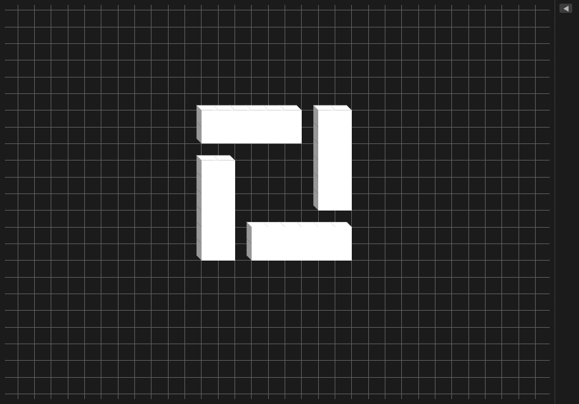

# Game of Life


Interactive implementation of Conway's Game of Life written in Rust using [`egui`](https://github.com/emilk/egui) and [`eframe`](https://github.com/emilk/egui/tree/master/crates/eframe), featuring both 2D and isometric 3D visualization modes.



## Features

- **Infinite grid** using a sparse `HashSet` representation
- **2D and isometric 3D view modes**
- **Live painting** with click and drag
- **Camera controls** with panning and zooming
- **Adjustable simulation speed**
- **Customizable cell colors**
- **Dark / Light theme toggle**
- **Generation and alive-cell counters**

## Controls

| Input | Action |
|-------|--------|
| `Space` | Start / pause simulation |
| `R` | Reset grid and simulation state |
| `→` | Increase simulation speed |
| `←` | Decrease simulation speed |
| Scroll | Zoom in / out |
| RMB Drag | Pan camera |
| LMB Click | Toggle cell |
| LMB Drag | Draw cells |

## Build & Run

### Prerequisites

- Rust (stable toolchain)
- On Linux: GTK3 and OpenGL headers

```bash
# Ubuntu / Debian
sudo apt install libgtk-3-dev libgl1-mesa-dev

# Arch / CachyOS / Manjaro
sudo pacman -S gtk3 mesa
```

### Clone and run:

```bash
git clone https://github.com/RizelBeri/game_of_life
cd game_of_life
cargo run --release
```

To build without running:

```bash
cargo build --release
```

The executable will be located in:

```
target/release/game_of_life
```

## Releases

Precompiled binaries for Linux (x86\_64) and Windows (x86\_64) are available on the [Releases](https://github.com/RizelBeri/GameOfLifeRust/releases) page.

On Linux, make the binary executable before launching:

```bash
chmod +x game_of_life
```
